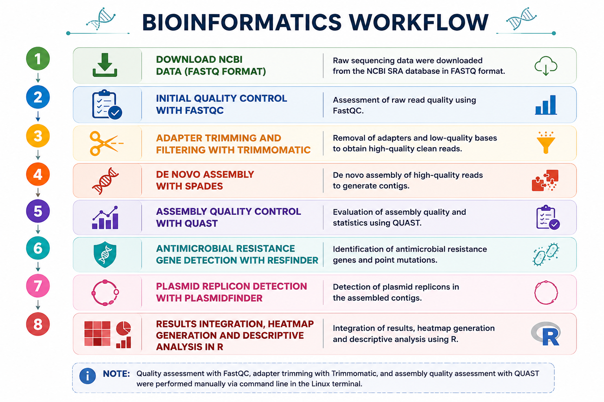

# Klebsiella-AMR-WGS

## Overview

This repository contains the bioinformatics pipeline and analysis scripts developed for the Master's Thesis entitled:

**Bioinformatic analysis of antimicrobial resistance genes and plasmid replicons in *Klebsiella pneumoniae* using whole genome sequencing data.**

The project analyses publicly available *Klebsiella pneumoniae* whole genome sequencing (WGS) data to identify antimicrobial resistance (AMR) genes, plasmid replicons and their coexistence patterns.

---

## Objectives

* Perform quality assessment of raw sequencing data.
* Assemble bacterial genomes from Illumina paired-end reads.
* Identify acquired antimicrobial resistance genes.
* Detect plasmid replicons.
* Explore associations between AMR genes and plasmid replicons.
* Generate summary tables and graphical representations of the results.

---

## Bioinformatics workflow

The complete workflow is illustrated below.



The pipeline consisted of the following steps:

1. Download of raw sequencing data from the NCBI Sequence Read Archive (SRA).
2. Initial quality assessment using FastQC.
3. Adapter trimming and quality filtering using Trimmomatic.
4. De novo genome assembly using SPAdes.
5. Assembly quality assessment using QUAST.
6. Detection of antimicrobial resistance genes using ResFinder.
7. Detection of plasmid replicons using PlasmidFinder.
8. Data integration, descriptive analysis and visualization in R.

---

## Pipeline implementation

Raw paired-end whole genome sequencing data were downloaded from the National Center for Biotechnology Information (NCBI) Sequence Read Archive (SRA) in FASTQ format.

Initial quality assessment was performed manually using **FastQC v0.12.1** by executing the software directly from the Linux terminal for each pair of FASTQ files. The generated reports were inspected to evaluate per-base sequence quality, GC content, sequence duplication levels and adapter contamination before downstream processing.

Adapter trimming and quality filtering were performed manually using **Trimmomatic v0.40** in paired-end mode. The following parameters were applied:

* `SLIDINGWINDOW:4:20`
* `MINLEN:50`

These settings removed low-quality bases and short reads while preserving paired-end relationships for downstream analyses.

Genome assembly was automated using a custom Bash script based on **SPAdes v3.15.5**, employing the `--careful` option while keeping all other parameters at their default values.

Assembly quality was assessed using **QUAST v5.3.0**. The quality metrics evaluated included the number of contigs, largest contig length, total assembly length, GC content, N50 and L50 values.

Detection of antimicrobial resistance genes was performed using **ResFinder v4.7.2**, executed locally with **BLASTn v2.16.0+**, applying minimum thresholds of **90% sequence identity** and **80% coverage**.

Plasmid replicons were identified using **PlasmidFinder v3.0.3**, also executed locally with **BLASTn v2.16.0+**, using the same thresholds (**90% identity** and **80% coverage**).

Genome assembly, ResFinder, PlasmidFinder and downstream analyses were automated using the Bash and R scripts included in this repository.

---

## Software

* FastQC v0.12.1
* Trimmomatic v0.40
* SPAdes v3.15.5
* QUAST v5.3.0
* ResFinder v4.7.2
* PlasmidFinder v3.0.3
* BLASTn v2.16.0+
* R v4.2.1
* RStudio 2026.04.0+526

R packages:

* tidyverse
* ggplot2
* dplyr
* tidyr
* readr
* purrr

---

## Repository structure

```text
Klebsiella-AMR-WGS/
│
├── README.md
├── LICENSE
├── .gitignore
│
├── bash/
│   Bash scripts used to automate genome assembly,
│   ResFinder and PlasmidFinder analyses.
│
├── R/
│   R scripts used for data processing,
│   statistical summaries and figure generation.
│
├── results/
│   Final figures generated during the analysis.
│
└── workflow/
    Workflow diagram illustrating the complete pipeline.
```

---

## Input data

The sequencing datasets analysed in this project were obtained from the **NCBI Sequence Read Archive (SRA)**. Only paired-end Illumina whole genome sequencing datasets were included in the analysis.

---

## Reproducibility

This repository contains the custom Bash and R scripts developed during this project to reproduce the bioinformatics analyses presented in the Master's Thesis.

Raw sequencing reads, intermediate files and external databases are not included because they are publicly available from their original repositories or can be regenerated by executing the pipeline.

---

## Author

**Pablo Llinares Frende**

Master's Thesis in Bioinformatics

